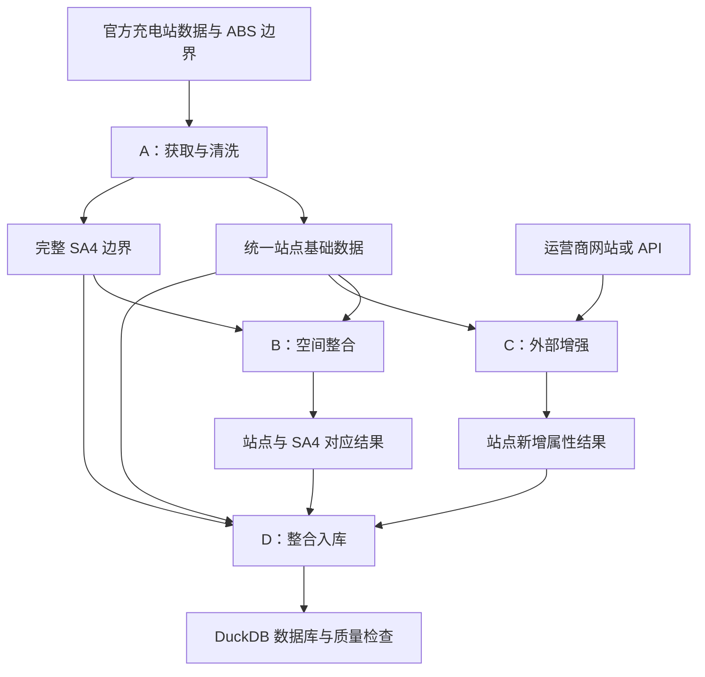

# COMP5339 Assignment 1 — EV Charger Data Integration

本仓库用于四人小组通过 Jupyter 完成 NSW 充电站数据获取、清洗、空间整合、外部增强和 DuckDB 存储。

当前状态：仅建立目录、Notebook 骨架和协作说明；数据处理逻辑、数据库设计和成果尚未实现。

项目说明文件：

- [英文原件：COMP5339_2026s2_Assignment1.pdf](output/pdf/COMP5339_2026s2_Assignment1.pdf)
- [中文译版：COMP5339_2026s2_Assignment1中文版.pdf](output/pdf/COMP5339_2026s2_Assignment1中文版.pdf)

中文译版供小组理解要求使用；如有歧义，以英文原件为准。

## 1. 项目介绍与预期成果

本项目要为 NSW 电动车充电站建立一套信息统一、可按地理区域查询的电子档案。信息来自三个地方：官方充电站数据提供位置和基本属性，ABS 边界提供 SA4 区域范围，运营商网站或其他 API 提供额外的充电属性。团队需要用程序获取、清洗、关联这些信息，并保存为可以重新生成的数据库。

本次重点是数据工程：交付可用数据和可复现流程，不要求开发网页、手机 App 或机器学习模型。Assignment 2 将继续使用本次成果。

### 一条站点记录会经历什么？

以下仅为流程示意，不是真实数据或已完成结果：

| 阶段 | 记录的变化 |
| --- | --- |
| 原始记录 | 包含某站点的名称、经纬度、充电类型等已有属性 |
| 清洗后 | 类型和命名统一，重复、缺失及异常按明确规则处理 |
| 空间整合后 | 根据位置关联所属 SA4 区域 |
| 外部增强后 | 补充原始数据没有的插头、价格、车位数量等一种或更多属性 |
| 入库后 | 能查询站点信息、地区归属和新增属性，并保留来源说明 |

### 最终得到什么？

| 成果 | 用途 |
| --- | --- |
| DuckDB 数据库及重建结构的 DDL | 直接查询整理后的数据，为后续作业提供基础 |
| Notebook、数据文件、依赖和运行说明 | 让其他成员或老师重新运行并生成结果 |
| 项目报告与 AI 使用报告 | 说明方法、质量、局限、设计理由和成员贡献 |

可以用“每个 SA4 有多少充电站”“哪些属于 DC 快充”“哪些站点仍缺少增强信息”等问题验证数据是否可用。这些是检查示例，不是额外要求开发的产品功能。

## 2. 技术路线与依赖关系

### 原项目说明中的数据来源链接

以下三个链接按英文项目说明原文收录，属于数据来源页面，不一定是可直接下载文件的地址。

| 数据 | 原文网站链接 | 作业要求与用途 | 负责人 |
| --- | --- | --- | --- |
| NSW 电动车充电站位置 | [Transport for NSW：EV charging locations](https://opendata.transport.nsw.gov.au/data/dataset/ev-charging-locations) | 与下一行二选一获取充电站数据；原文要求使用 2025 年 12 月版本，并说明该网站需要免费注册登录 | A |
| 同一充电站数据的替代入口 | [data.gov.au：NSW EV charging locations](https://data.gov.au/data/dataset/nsw-2-ev-charging-locations) | 官方说明提供的替代来源，不是需要额外合并的第二份充电站数据 | A |
| ABS SA4 区域边界 | [ABS：ASGS Edition 4 数字边界文件](https://www.abs.gov.au/statistics/standards/australian-statistical-geography-standard-asgs/edition-4-july-2026-june-2031/access-and-downloads/digital-boundary-files) | 获取 SA4 层级的数字边界 shapefile，用于判断站点所属区域 | A 获取，B 使用 |

原文还将充电运营商网站、Open Charge Map 和 Google Maps 列为数据增强的示例来源，但没有提供其具体网址或 API 端点，也没有要求全部使用。C 选定来源后，应在本 README 补充实际访问链接、API 使用方式、匹配策略和获取时间。

数据获取必须通过 Python 或 Unix 脚本自动完成，不能依赖手动下载。实现时需确认实际下载地址和数据版本，并记录与原文要求之间的任何差异。

### 处理步骤

以下是计划采用的路线；具体依赖和实现方法需在开发、验证后更新。

| 步骤 | 处理内容与可用工具 | 输出 | 负责人 |
| --- | --- | --- | --- |
| 自动获取 | 用 Python 获取说明指定的 2025 年 12 月充电站数据及 ASGS Edition 4 SA4 边界，保留原始文件 | 官方原始数据 | A |
| 清洗 | 用 Python／pandas 检查类型、缺失、重复、命名、坐标和记录粒度 | 统一站点基础数据及质量统计 | A |
| 空间整合 | 用 GeoPandas 或 DuckDB 空间功能，统一坐标参考系统并判断站点落在哪个 SA4 多边形内 | 站点与 SA4 对应结果及异常清单 | B |
| 外部增强 | 用 Python 访问网站或 API，按名称、地址、坐标等匹配站点，保存获取副本 | 新增属性、来源、匹配与覆盖率结果 | C |
| 整合入库 | 用 DuckDB 和 spatial 扩展存储数据，通过 SQL 检查数量和关联 | 最终数据库及独立 DDL | D |

增强对象以 DC 快充站点为主，目标是至少 50% 的 DC 站点获得至少一种原始数据没有的属性。覆盖率计算必须说明记录粒度、去重方式和分子分母。



### 谁需要等谁？

| 成员 | 正式处理依赖 | 可以提前开展的工作 |
| --- | --- | --- |
| A | 官方来源与作业要求 | 获取数据、检查字段、定义基础输出 |
| B | A 的站点坐标、稳定标识和 SA4 边界 | 检查边界格式、坐标系统和空间连接方法 |
| C | A 的 DC 站点清单和匹配字段 | 验证外部来源是否可访问、是否有新增属性 |
| D | 最终入库依赖 A、B、C 的结果 | 准备环境、讨论设计、约定接口，用样本搭建流程 |

A 应尽早交付真实小样本和字段说明，让 B、C 并行开发，让 D 开始集成；不必等 A 的所有清洗工作结束。A 完成后可支援 C 的匹配检查，B 完成后可支援 D 的集成验证。

全组首先确认“一行代表一个站点、设备还是接口”，再约定稳定标识。一个站点可能对应多个插头或外部记录，直接合并可能重复计算站点，因此交接时必须解释一对多关系。

## 3. 分工与文件说明

### 成员职责与交付成果

每位成员负责自己模块的代码、结果验证和对应报告内容。以下为计划分工，最终贡献说明应根据实际工作填写。

| 成员 | 负责内容 | 输入／依赖 | 交付成果 | 完成标准 |
| --- | --- | --- | --- | --- |
| **A：组长、数据获取与清洗** | 自动获取官方充电站数据和 ABS SA4 边界；处理类型、缺失、重复和命名问题；明确记录粒度与稳定标识；协调进度和交接 | 官方数据来源及作业要求 | `01_acquire_clean.ipynb`；`data/raw/` 原始文件；`chargers_clean.csv`；字段说明、清洗规则与质量统计；报告中的数据获取和清洗部分 | 重启内核后能从头运行；B 能使用坐标和边界，C 能筛选 DC 站点，D 能读取数据；已知问题有说明 |
| **B：空间整合** | 检查坐标参考系统；将站点与 SA4 边界空间关联；检查未匹配和多重匹配记录 | A 的清洗数据、稳定标识、坐标说明及完整 SA4 边界 | `02_spatial.ipynb`；`charger_sa4.csv`；空间匹配统计与异常说明；报告中的空间整合部分 | 结果能通过统一标识关联基础数据；匹配和异常情况可解释；D 能直接使用 |
| **C：外部数据增强** | 验证外部来源；程序化获取新属性；匹配 DC 站点；保存获取副本；检查匹配质量和覆盖率 | A 的清洗数据，尤其充电类型、名称、地址、坐标等字段；外部网站或 API | `03_augment.ipynb`；`data/external/` 获取副本；`charger_attributes.csv`；来源、匹配方法和覆盖率统计；报告中的增强部分 | 目标覆盖至少 50% 的 DC 站点；新增属性原始数据中没有；分子分母、来源及一对多关系明确 |
| **D：数据库与集成** | 主导数据库设计讨论；实现 DuckDB 和 spatial 扩展；整合各模块；验证关联；整理运行说明与提交包 | A 的基础数据、B 的空间结果、C 的增强结果及必要区域数据 | `04_database.ipynb`；`schema.sql`；`project.duckdb`；数据库设计图；完整 README、依赖文件和提交包；报告中的数据库部分 | 数据库可查询且数量、关联合理；DDL 可重建结构；另一成员能按 README 复现完整流程 |

### 共同任务与收尾分工

| 共同任务 | 分工 |
| --- | --- |
| 接口约定 | A 组织，全组确认字段、站点标识、记录粒度、路径和版本规则 |
| 代码复核 | B 复核 A；D 复核 B；A 复核 C；C 复核 D |
| 报告 | 各自写模块内容；B 汇总挑战与局限；D 统一排版；全组核对数字 |
| 最终复现 | A 在干净环境运行；各模块负责人修复自己的问题；D 处理集成问题 |
| AI 使用报告 | 每人记录自己的使用情况，A 汇总 |
| 最终提交 | D 准备完整文件包，A 核对并上传，另一成员确认提交状态 |

交付顺序：A 先给真实小样本和字段说明 → B、C 并行开发，D 同步搭建集成 → 全量交接 → 全组复现与提交。

### 文件位置与负责人

| 文件或目录 | 内容 | 输出负责人 | 接收人 |
| --- | --- | --- | --- |
| `notebooks/01_acquire_clean.ipynb` | 官方数据自动获取、清洗和质量检查 | A（组长） | B、C、D |
| `data/raw/` | 官方充电站原始数据、完整 ABS SA4 边界文件 | A 的 Notebook | B 及全组 |
| `data/processed/chargers_clean.csv` | 统一站点基础数据，运行 A 后生成 | A 的 Notebook | B、C、D |
| `notebooks/02_spatial.ipynb` | 坐标处理和 SA4 空间关联 | B | D |
| `data/processed/charger_sa4.csv` | 站点与 SA4 的对应结果，运行 B 后生成 | B 的 Notebook | D |
| `notebooks/03_augment.ipynb` | 外部数据获取、站点匹配和增强覆盖率检查 | C | D |
| `data/external/` | 外部获取结果本地副本 | C 的 Notebook | C、D |
| `data/processed/charger_attributes.csv` | 新增属性、来源和匹配信息，运行 C 后生成 | C 的 Notebook | D |
| `notebooks/04_database.ipynb` | 整合、建库、加载与验证 | D | 全组 |
| `sql/schema.sql` | 重建数据库结构的 DDL，目前为占位文件 | D | 全组 |
| `data/final/project.duckdb` | 最终数据库，运行 D 后生成 | D 的 Notebook | 全组 |
| `requirements.txt` | Python 依赖；目前仅列出 Notebook 开发工具 | 全员提供，D 汇总验证 | 全组 |
| `README.md` | 运行、字段、质量和交接说明 | A 建立，全员补充，D 整理 | 全组 |

以上 CSV 和数据库尚未生成，不创建空文件冒充处理成果。

## 4. 环境与启动

在项目根目录打开终端，创建独立环境并启动 Jupyter：

```bash
python3 -m venv .venv
source .venv/bin/activate
python -m pip install -r requirements.txt
python -m jupyterlab
```

Windows 激活命令为 `.venv\Scripts\activate`。选择该环境对应的 Python 内核。

- 团队验证过的 Python 版本：待填写。
- 数据处理所需依赖及版本：各负责人实现时补充，由 D 实际验证。
- Notebook 位于 `notebooks/`；实现时显式确定项目根目录，所有数据路径基于该目录。启动 Jupyter 的目录不保证等于内核工作目录。
- 不使用个人电脑绝对路径；密钥通过本地环境配置，不提交到仓库。

## 5. 运行顺序

1. A：运行 `01_acquire_clean.ipynb`，生成原始文件和清洗后的基础数据。
2. B、C：分别运行 `02_spatial.ipynb` 和 `03_augment.ipynb`，两者可以并行。
3. D：运行 `04_database.ipynb`，整合所有结果并生成 DuckDB 数据库。
4. 由另一成员在干净环境依照本说明完整复现。

当前 Notebook 只有章节提示，尚不能生成数据。模块实现后须重启内核并按顺序运行所有单元格，验证不依赖历史变量。

## 6. 交接约定

- 使用磁盘文件交接，不依赖 Notebook 内存变量。
- A 提供稳定站点标识和基础数据；B、C 独立输出，不覆盖 A 的文件。
- B 额外接收完整 SA4 边界。Shapefile 必须保留所需配套文件。
- 不使用 CSV 行号关联站点。站点标识、记录粒度和一对多关系须由全组先确认。
- 每次交接记录输入数据版本、代码提交、生成时间、输出位置、质量统计和已知问题。
- 字段名、标识或记录粒度变更前通知下游。下游检查是否需要重新生成结果。
- D 用程序生成最终数据库，不多人直接修改同一数据库文件。

### 基础数据字段说明（A 填写）

| 字段 | 含义 | 类型／单位 | 缺失值约定 | 备注 |
| --- | --- | --- | --- | --- |
| 待确认 | 检查原始数据后填写实际字段 | 待填写 | 待填写 | 不预设未经确认的字段 |

需明确：一行代表什么、稳定站点标识、坐标参考系统、DC 类型识别方式，以及保留的名称／地址／运营商信息。

### 质量与处理记录（各负责人填写）

| 模块 | 应记录的内容 | 实际结果 |
| --- | --- | --- |
| A | 原始与清洗后数量、重复、缺失、排除原因和清洗规则 | 待填写 |
| B | 空间匹配率、未匹配／多重匹配及处理方式 | 待填写 |
| C | 来源、匹配策略、覆盖率分子分母、可靠性和缺失 | 待填写 |
| D | 入库数量、关联完整性、空间能力与复现结果 | 待填写 |

## 7. 协作工具、进度与集成

以下为团队建议工作方式；任务看板和分支检查规则需要团队实际建立，当前 README 不代表它们已配置。

| 工具 | 解决的问题 | 使用约定 |
| --- | --- | --- |
| Jupyter Notebook | 查看数据、开发和记录处理过程 | 每人维护自己的模块，使用文件交接 |
| Git 与共享 GitHub 仓库 | 保存代码版本，追踪修改 | 开始工作前同步已合并版本，在独立分支开发 |
| GitHub Issues／任务看板 | 统一负责人、依赖和进度 | 每项任务写清负责人、输入、输出和验收标准 |
| Pull Request（PR） | 检查修改并整合代码 | 说明改动、运行方式和验证结果，由另一人复核 |
| 虚拟环境与 requirements.txt | 统一运行依赖 | 记录验证过的 Python 和包版本 |
| README | 保存最终运行及交接约定 | 有变更及时更新，避免依赖口头解释 |
| 小组群聊 | 日常讨论、提醒与协调 | 最终决定同步到任务或仓库文档 |

每人维护自己的 Notebook，通过独立分支和 PR 交接；另一成员验证后再合并。任务状态使用：待开始、进行中、待复核、已完成。

一次交接的流程是：领取任务 → 同步代码 → 完成小范围修改 → 重启内核并从头验证 → 提交 PR → 另一人检查 → 合并并验证现有完整流程。任务完成意味着代码、输出和说明齐全，并且另一成员能按说明运行使用。

建议每天用十分钟同步“已完成什么、被什么阻塞、下一次交付什么”，附上对应任务或 PR。各人同时记录自己的方法、质量数字和局限，并负责相应报告内容；D 统一整理，全组互相讲解模块。

| 阶段 | 应完成内容 |
| --- | --- |
| 接口与初版 | A 交真实样本及字段说明；B 检查边界；C 验证外部来源；D 准备集成 |
| 小样本集成 | 少量真实数据贯通 A → B/C → D |
| 全量集成 | 全量处理，核对数据质量与增强覆盖率 |
| 提交前复现 | 干净环境从头运行，报告数字与最终数据库一致 |

必须尽早完成小样本贯通，再做全量集成，最后进行干净环境复现。不要把首次完整运行留到提交前；上游字段或标识改变后，检查下游数据及报告统计是否需要重新生成。

## 8. 数据版本与提交

`.gitignore` 默认忽略数据目录里的实际文件，保留 `.gitkeep` 以跟踪目录。代码仓库不会自动向其他成员分发这些数据。

首次交接前，全组确定共享数据位置并在此填写；交接时提供明确版本。官方数据仍须支持脚本自动获取，外部增强数据保留本地副本。

- 共享数据位置：待填写。
- 当前基础数据版本：待填写。
- 外部数据缓存版本：待填写。

最终 Canvas 提交应包含：

1. 代码与数据库 ZIP：代码、要求的数据、依赖、README、DDL 和 DuckDB 文件。注意将被 Git 忽略的必要数据一并打包。
2. 项目报告 PDF：正文最多 6 页，封面列组名、成员姓名和 SID，成员贡献说明不超过 100 词。
3. AI 与自动写作工具使用报告：全员持续记录，按课程要求汇总。

截止时间：2026 年 9 月 25 日 23:59，以课程平台通知为准。
