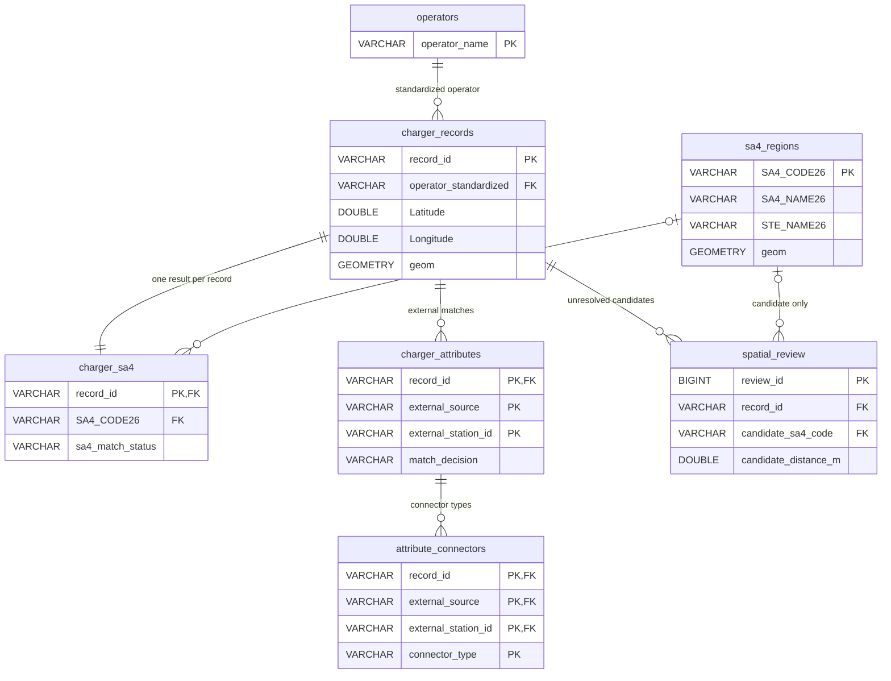

# D: Database Design and Validation

## Record Granularity and Relationships

Each row in `charger_records` represents a source record retained by A, identified by a content-derived `record_id` hash. Multiple records may share the same location; D does not automatically merge them into a single physical charging site. Standardized operator names serve as natural keys, while original names and quality flags remain in the base table.

The diagram shows the main data tables and selected fields. The complete column definitions and constraints are provided in `sql/schema.sql`.

`build_inputs` and `build_metadata` are database-wide audit tables. They record relative file paths, SHA-256 fingerprints, import timestamps and quality results. Import timestamps are not presented as external data retrieval timestamps.

## Design Rationale

- Standardized operators and regions are stored separately to avoid repeating shared attributes and large geometries. The base table retains all fields supplied by A, and the augmentation table retains all fields supplied by C for traceability.
- B's region and state names are retained as handoff snapshots, although they also appear in the region table. They are checked against the supplied boundaries before loading; inconsistent values are rejected.
- C currently supplies at most one accepted match per source record. The composite primary key supports multiple sources or external records in future. Different source records may reference the same external ID; this alone does not justify merging or deleting them.
- Connector types are separated into a child table for filtering, while C's original combined string is retained. Power values are not paired with individual connector types because C did not supply that relationship.
- `charger_overview` uses `EXISTS` to indicate whether augmentation is available without expanding one-to-many matches. `sa4_summary` therefore counts source records.
- Primary keys, foreign keys and check constraints protect key relationships and numeric ranges. Database constraints cannot establish whether an external match is factually correct.

## Spatial Data and Quality

Charger point geometries use x = longitude and y = latitude. Their CRS is EPSG:4326, following B's provisional WGS84 assumption, which remains unconfirmed. SA4 geometries retain their original EPSG:7844 CRS. Points are explicitly transformed before spatial comparisons in SQL, with `always_xy := true`. ABS non-spatial statistical categories without geometry remain in the region table but do not participate in spatial matching.

During the build, DuckDB independently repeats the `within` spatial join for all source records and compares the resulting region codes with B's output. Multiple matches or inconsistencies stop the build. This establishes implementation consistency, not agreement between source coordinates and real-world addresses. B's nearest-region candidates remain in `spatial_review`; they do not replace NULL values for unmatched records.

## Coverage Definitions

C selects records where `charger_type_standardized == 'DC'`. Record-level coverage uses unique `record_id` values. Location-level coverage uses Python's `(round(latitude, 6), round(longitude, 6))` rule. Only accepted matches with at least one additional attribute contribute to the numerator.

For the supplied inputs, record-level coverage is 216/433, approximately 49.88%, and location-level coverage is 215/430 = 50.00%. The location grouping follows C's approximate rule; it is not an independently resolved physical-site identifier.

## Reproducing Module D

The reproduction scope is Module D, starting from the completed A/B/C handoff files. D rebuilds the database from the supplied processed CSV files and SA4 boundary ZIP. C's raw API caches, candidate-review files and API key are not required. The first installation of the official `spatial` extension requires network access; subsequent runs reuse the local extension cache.

D preserves the supplied augmentation decisions and associated provenance fields. Repeating C's retrieval or independently reviewing all its matching decisions is outside D's reproduction scope. An external verification date must not be described as a retrieval date.

The build writes a temporary database first and replaces the published database only after validation and closure. Validation failures preserve the previous successful database. Input SHA-256 fingerprints identify the exact file versions. Reproduction means equivalent tables and validated results; changing build timestamps mean that the database file is not expected to be byte-for-byte identical.

## Technical References

- [DuckDB spatial installation and loading](https://www.duckdb.org/docs/current/core_extensions/spatial/overview)
- [DuckDB spatial functions and CRS transformations](https://duckdb.org/docs/current/core_extensions/spatial/functions)
- [DuckDB extension cache directory](https://www.duckdb.org/docs/current/extensions/installing_extensions)
